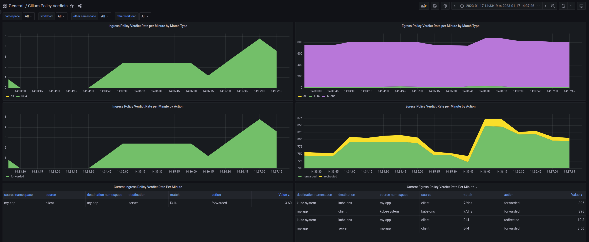

Cilium Policy Verdicts Dashboard
================================

This dashboard provides visibility on Network Policy application in a Cilium
cluster.




## Requirements


### Cilium Version

This dashboard uses the `hubble_policy_verdicts_total` metrics, which was
introduced in:
- Isovalent Cilium Enterprise 1.12.0
- Cilium OSS 1.13.0


### Configuration

The `hubble_policy_verdicts_total` needs to be enabled in the Cilium metrics.

This can be achieved by using the `policy` metrics in `hubble.metrics.enabled`,
for example using Helm values:

```yaml
hubble:
  metrics:
    enabled: "{dns,drop,tcp,flow,port-distribution,icmp,http,policy:sourceContext=app|workload-name|pod|reserved-identity;destinationContext=app|workload-name|pod|dns|reserved-identity;labelContext=source_namespace;destination_namespace}"
```

This example will enable `dns`, `drop`, `tcp`, `port-distribution`, `icmp`,
`http`, and `policy` metrics. Additionally, it will configure the labels for
the `policy` metric series to use:
- `app`, `workload-name`, `pod` or `reserved-identity` for source flows
- `app`, `workload-name`, `pod`, `dns`, or `reserved-identity` for destination flows
- additional `source_namespace` and `destination_namespace` labels

The present Grafana dashboard is optimized for this context configuration (see [documentation](https://docs.cilium.io/en/stable/operations/metrics/#context-options)).
